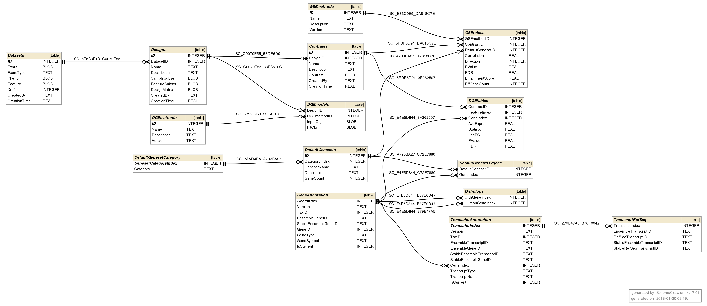

### ROGER Database

* **Annotations**
  * Gene Annotation (consumes biomart)
    * GeneAnnotation: Ensemble & NCBI gen IDs. ROGER-internal GeneIndex, Gen meta data
    * Orthologs: Mapping between orthologous genes between different species
    * TranscriptioAnnotation: Ensemble Transcription ID and meta data
  * TranscriptRefSeq: NCBI Transcription ID and meta data
    * Genesets (consumes mongodb/json & gmt)
    * DefaultGenesets: Available gen set data
    * DefaultGenesetCategory: For gen set categorization
    * DefaultGenesets2gene: Mapping of gen set data to gen annotations
* **Input**
  * Datasets: Raw expression data
  * Phenodata
  * Designs: Relevant Feature matrix
  * Contrasts: Contrast matrix
* **Methods & Results**
  * GSEmethods: Used Gen enrichment method (e.g. CAMERA)
  * GSEtables: Gen enrichment results
  * DGEmethods: Used Differential Gen Expression inference method (e.g.  edgeR, limma)
  * DGEmodels: Used DGE model based on Desing and Cntrast information
  * DGEtables: Results from DEG inference

#### Annotation Problems:

* Have to support both Ensembl and NCBI IDs
* Ensembl has many unconsistent / deprecated data: Some Gene Symbols apper in multiple EnsembleGeneIds, 
  * Possible fix: pick the "most accurate on" (e.g. does it have a proper chromosone? Number of Transcripts etc.)

#### RESTful APIs for scientific R pipelines

* [rplumber](https://www.rplumber.io/)
  * Fastest way to deploy REST services
  * Very low-level: No load balancing, no authentication, task management, ...
* [OpenCPU](https://www.opencpu.org)
  * Load balancing
  * Lightwing WEB API basedn on JavaScript
  * No build-in support for [long running jobs]
  (https://github.com/opencpu/opencpu/issues/141)
  * No build-in task management
* [Flask](http://flask.pocoo.org)
  * Python equivalent to OpenCPU
  * Established in the department
  * Requires wapper functions between python <-> R
  * No build-in task management